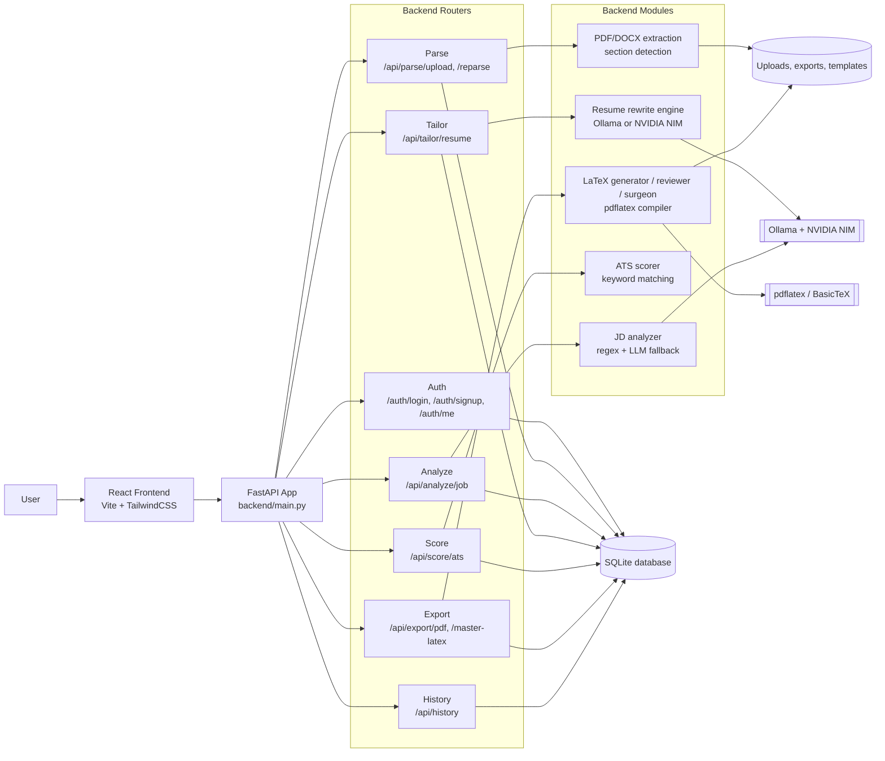

# ResumeForge 🔨

> AI-powered resume tailoring system — 100% local, 100% private, production-ready.

**Upload resume → Analyze job → AI tailoring → ATS scoring → Professional LaTeX PDF**

No API costs. No data leaves your machine. Powered by local LLM (Ollama) + NVIDIA NIM option.

---

## 🎯 What It Does

ResumeForge is a complete end-to-end resume optimization pipeline:

1. **📄 Upload** — Parse PDF/DOCX resumes with intelligent section detection
2. **🔍 Analyze** — Extract company, role, required/nice-to-have skills from JD (4 regex patterns + LLM)
3. **✂️ Tailor** — Rewrite resume content to match job requirements (local Ollama or cloud NVIDIA NIM)
4. **📊 Score** — ATS keyword matching with before/after comparison (0-100 score)
5. **📥 Export** — Generate professional PDFs with LaTeX (clean single-column layout)

---

## 🚀 Tech Stack

| Layer | Technology | Status |
|-------|-----------|--------|
| **Backend** | FastAPI (Python 3.10+) | ✅ Production |
| **Database** | SQLite + SQLAlchemy ORM | ✅ Production |
| **Local LLM** | Ollama — `qwen3:14b` (9.3 GB) | ✅ Production |
| **Cloud LLM** | NVIDIA NIM — `llama-3.3-70b-instruct` | ✅ Optional |
| **PDF Parsing** | pdfplumber (layout-aware) | ✅ Production |
| **DOCX Parsing** | python-docx | ✅ Production |
| **PDF Export** | LaTeX + pdflatex (BasicTeX) | ✅ Production |
| **Frontend** | React 18 + Vite + TailwindCSS | ✅ Production |
| **Auth** | JWT (stateless, bcrypt) | ✅ Production |

---

## ✅ Features (All Complete)

| | Feature | Status | Details |
|-|---------|--------|---------|
| ✅ | **JWT Authentication** | Production | Signup, login, protected routes |
| ✅ | **Resume Parser** | Production | PDF + DOCX with layout-aware extraction |
| ✅ | **Section Detection** | Production | 8 patterns + LLM fallback (Education, Experience, Skills, etc.) |
| ✅ | **Job Analyzer** | Production | 4 regex patterns for company/title + skills extraction |
| ✅ | **Resume Tailor** | Production | Ollama (local, 2-3 min) or NVIDIA NIM (cloud, 15-20s) |
| ✅ | **ATS Scorer** | Production | Keyword matching, before/after comparison, 0-100 score |
| ✅ | **LaTeX PDF Export** | Production | Professional single-column layout, contact in header |
| ✅ | **React Frontend** | Production | 5-step pipeline with progress bar, PDF preview iframe |

---

## 📸 Screenshots

### 5-Step Pipeline
1. **Upload Resume** → Parse sections with intelligent detection
2. **Analyze Job** → Extract company, role, required/nice-to-have skills
3. **Tailor Resume** → AI rewriting with Ollama or NVIDIA NIM
4. **ATS Score** → Before/after comparison with delta badge
5. **Export PDF** → LaTeX generation with Overleaf-style preview

### Key Features
- **Before/After ATS Scoring** — Visual comparison with +/- points indicator
- **PDF Preview** — Overleaf-style iframe preview before download
- **Dual AI Options** — Local (private, slower) or Cloud (fast, shared)
- **Regex Fallback** — Works even without LLM for basic extraction

---

## 🚦 Project Status

**Current Version:** Day 7 Complete (LaTeX Backend + React Frontend)  
**Branch:** `dev` (latest), `main` (stable)  
**Status:** ✅ **Production Ready**

### Recent Updates (March 2026)

**v7.3** — ATS Comparison & State Management (Mar 24)
- ✅ Before/after ATS score comparison with delta badge
- ✅ Fresh job_id state management (no stale data)
- ✅ Zero-score warning with helpful message
- ✅ "Analyze Different JD" button for re-analysis

**v7.2** — JD Analyzer Enhancements (Mar 23)
- ✅ Ollama qwen3:14b model loaded (9.3 GB)
- ✅ 4 regex patterns for company/title extraction
- ✅ Skills extraction with "Requirements:" and "Nice to have:"
- ✅ Regex fallback when LLM unavailable

**v7.1** — LaTeX PDF Engine (Mar 21)
- ✅ Replace ReportLab with LaTeX for professional output
- ✅ Clean single-column layout with proper typography
- ✅ Section deduplication and contact-in-header enforcement
- ✅ Overleaf-style PDF preview in frontend

**v7.0** — React Frontend Complete (Mar 20)
- ✅ 5-step pipeline with progress bar
- ✅ Modern gradient UI with TailwindCSS
- ✅ JWT authentication with protected routes
- ✅ Robust error handling and loading states

---

## 🏗️ Architecture

ResumeForge is a layered monolith: the React UI drives a FastAPI backend, the backend routes call focused modules for parsing, analysis, tailoring, scoring, and export, and all state lands in SQLite plus generated files on disk.



### Layer Breakdown

| Layer | Responsibility | Main Files |
|-------|----------------|------------|
| UI | Auth, step-by-step workflow, history tab | `frontend/src/App.jsx`, `frontend/src/pages/Dashboard.jsx` |
| API | HTTP routing, validation, auth, orchestration | `backend/main.py`, `backend/routers/*.py` |
| Domain logic | Parse, analyze, tailor, score, export | `backend/modules/*` |
| Storage | Session data, resumes, jobs, exports | `backend/data/resumeforge.db`, `backend/data/uploads`, `backend/data/exports` |
| AI + PDF | LLM calls and LaTeX compilation | `backend/modules/tailor/resume_tailor.py`, `backend/modules/export/*` |

### Project Structure

```text
resumeforge/
├── backend/
│   ├── main.py
│   ├── routers/
│   ├── modules/
│   ├── models/
│   ├── schemas/
│   ├── templates/
│   └── data/
├── frontend/
│   └── src/
│       ├── pages/
│       ├── components/
│       └── api/
└── documentedGuide/
```

### Request Flow

1. The user uploads a resume or signs in through the React frontend.
2. FastAPI stores and retrieves data through SQLAlchemy and SQLite.
3. Job analysis and resume tailoring call Ollama or NVIDIA NIM when LLM help is needed.
4. Export routes compile LaTeX to PDF with pdflatex and persist the result under `backend/data/exports`.

---

## 🔌 API Routes

| Method | Route | Auth | Description |
|--------|-------|------|-------------|
| POST | `/auth/signup` | No | Create account |
| POST | `/auth/login` | No | Get JWT token |
| GET | `/auth/me` | Yes | Get current user profile |
| GET | `/api/parse/status` | No | Parse service health check |
| POST | `/api/parse/upload` | Yes | Upload resume and parse sections |
| POST | `/api/parse/reparse/{resume_id}` | Yes | Re-run parsing for a stored resume |
| GET | `/api/analyze/status` | No | Analyzer health check |
| POST | `/api/analyze/job` | Yes | Analyze job description and extract skills |
| GET | `/api/tailor/status` | No | Tailor service health check |
| POST | `/api/tailor/resume` | Yes | Tailor resume to a job |
| GET | `/api/score/status` | No | ATS scorer health check |
| POST | `/api/score/ats` | Yes | Score resume against a job |
| GET | `/api/export/status` | No | Export service health check |
| POST | `/api/export/pdf` | Yes | Generate PDF from resume content |
| POST | `/api/export/pdf/async` | Yes | Start asynchronous export job |
| GET | `/api/export/status/{job_id}` | Yes | Check async export status |
| GET | `/api/export/result/{job_id}` | Yes | Fetch async export result |
| POST | `/api/export/master-latex` | Yes | Store master LaTeX for a resume |
| GET | `/api/export/master-latex/{resume_id}` | Yes | Check whether master LaTeX exists |
| GET | `/api/history/` | Yes | List tailoring sessions |
| GET | `/api/history/{session_id}/pdf` | Yes | Download a session PDF |

**Interactive API Docs:** `http://localhost:8000/docs` (Swagger UI)

---

## 🛠️ Local Setup

### Prerequisites

- **macOS** (M-series recommended, Intel compatible)
- **Python 3.10+** (3.13 tested)
- **Node.js 18+** (for frontend)
- **Ollama** ([download](https://ollama.ai))
- **BasicTeX** (for PDF generation)
- **16GB+ RAM** (18GB ideal for qwen3:14b)

### 1️⃣ Clone Repository

```bash
git clone https://github.com/NikunjS91/resumeforge.git
cd resumeforge
```

### 2️⃣ Backend Setup

```bash
cd backend

# Create virtual environment
python3 -m venv venv
source venv/bin/activate

# Install dependencies
pip install -r requirements.txt

# Configure environment
cp .env.example .env
# Edit .env and set:
# - SECRET_KEY (generate with: openssl rand -hex 32)
# - Optional: NVIDIA_API_KEY for cloud AI

# Initialize database
python seed.py
```

### 3️⃣ Install LaTeX (for PDF generation)

```bash
# Install BasicTeX (140MB)
brew install basictex

# Update PATH
eval "$(/usr/libexec/path_helper)"
echo 'export PATH=$PATH:/Library/TeX/texbin' >> ~/.zshrc

# Install required LaTeX packages
sudo tlmgr update --self
sudo tlmgr install enumitem titlesec

# Verify
pdflatex --version  # Should show: pdfTeX 3.141592653-2.6-1.40.29
```

### 4️⃣ Pull LLM Model

```bash
# Start Ollama server (Terminal 1)
ollama serve

# Pull qwen3:14b model (Terminal 2)
ollama pull qwen3:14b  # ~9.3 GB download

# Verify
curl http://localhost:11434/api/tags | python3 -c \
  "import sys,json; print([m['name'] for m in json.load(sys.stdin)['models']])"
# Expected: ['qwen3:14b']
```

### 5️⃣ Frontend Setup

```bash
cd ../frontend

# Install dependencies
npm install

# Verify Vite config
cat vite.config.js  # Should proxy /api to localhost:8000
```

### 6️⃣ Start All Services

**Terminal 1 — Backend:**
```bash
cd backend
source venv/bin/activate
export PATH="/Library/TeX/texbin:$PATH"
uvicorn main:app --reload --port 8000
```

**Terminal 2 — Frontend:**
```bash
cd frontend
npm run dev
```

**Terminal 3 — Ollama (if not auto-started):**
```bash
ollama serve
```

### 7️⃣ Access Application

- **Frontend:** http://localhost:5173
- **Backend API:** http://localhost:8000/docs
- **Ollama:** http://localhost:11434

**Demo Login:**
- Email: `demo@resumeforge.com`
- Password: `demo123`

---

## 🧪 Testing the Full Pipeline

### Step-by-Step Test

1. **Login** at http://localhost:5173
   - Use demo credentials or create new account

2. **Upload Resume**
   - Click "Click to upload PDF or DOCX"
   - Select any resume file
   - Wait for parsing (sections appear as colored tags)

3. **Analyze Job Description**
   - Paste a job description with this format:
   ```
   Senior Full Stack Engineer at TechCorp
   Requirements: React, Node.js, PostgreSQL, Docker, AWS
   Nice to have: TypeScript, GraphQL, Redis
   ```
   - Click "Analyze JD"
   - Should show: "5 required · 3 nice-to-have"

4. **Tailor Resume**
   - Choose **Local — Ollama** (2-3 min, private) or **NVIDIA NIM** (15-20s, cloud)
   - Wait for completion (improvement notes appear)

5. **Check ATS Score**
   - Open browser console (F12 → Console)
   - Should see debug logs with scores
   - Visual display shows: Original (grey) → Tailored (colored) [+X pts]

6. **Export PDFs**
   - Click "⬇ Download Tailored Resume"
   - PDF preview appears in iframe (Overleaf-style)
   - Click "⬇ Download Original" to compare
   - Both PDFs open in Preview automatically

### Verification Checklist

- [ ] Company and title extracted correctly
- [ ] Skills shown as blue tags
- [ ] Tailoring completes without errors
- [ ] ATS score shows BOTH circles (original + tailored)
- [ ] Delta badge shows improvement (+X pts)
- [ ] PDF has clean single-column layout
- [ ] Contact info only in header (not body)
- [ ] No duplicate sections

---

## 🔧 Troubleshooting

### "pdflatex not found"
```bash
eval "$(/usr/libexec/path_helper)"
export PATH="/Library/TeX/texbin:$PATH"
```

### "Ollama connection refused"
```bash
ollama serve  # Must be running in separate terminal
```

### "Job has no required skills"
- Ensure JD includes "Requirements:" or "Must have:" section
- Skills should be comma-separated
- Fresh JD analysis needed (click "Analyze Different JD")

### Frontend not connecting to backend
- Check `vite.config.js` has proxy: `/api` → `http://localhost:8000`
- Verify backend is running on port 8000
- Check CORS settings in `backend/main.py`

### ATS score always 0
- Analyze fresh JD with required skills
- Check browser console for errors (F12)
- Verify job_id is from latest analysis (not stale)

---

## 🚀 Production Deployment


### Docker Deployment (Recommended)

```bash
# Build and run with docker-compose
docker-compose up -d

# Services:
# - Backend: http://localhost:8000
# - Frontend: http://localhost:5173
# - Ollama: http://localhost:11434
```

### Manual Deployment

1. **Backend:**
   - Use `gunicorn` instead of `uvicorn --reload`
   - Set `DATABASE_URL` to PostgreSQL (not SQLite)
   - Configure nginx as reverse proxy
   - Enable HTTPS with Let's Encrypt

2. **Frontend:**
   ```bash
   npm run build
   # Serve dist/ with nginx or Caddy
   ```

3. **Ollama:**
   - Run as systemd service on Linux
   - Use launchd on macOS
   - Ensure 16GB+ RAM for qwen3:14b

---

## 📊 Hardware Requirements

### Development (Minimum)
- **RAM:** 12GB (8GB system + 4GB model)
- **Disk:** 15GB (10GB model + 5GB project)
- **CPU:** Apple M1/M2/M3 or Intel i5+

### Production (Recommended)
- **RAM:** 18GB (10GB system + 8GB model buffer)
- **Disk:** 20GB (15GB model + 5GB data)
- **CPU:** Apple M3 Pro or equivalent
- **Inference Speed:** ~60 tokens/sec on M3 Pro

### Tested Configuration
| Component | Spec |
|-----------|------|
| Machine | MacBook Pro M3 Pro |
| RAM | 18GB unified memory |
| Model | qwen3:14b (~12GB loaded in RAM) |
| Inference | ~60 tokens/sec |
| Tailoring Time | 2-3 minutes (full resume) |

---

## 🌳 Branch Strategy

```
main              ← Stable production releases
  │
dev               ← Active development (latest features)
  │
  ├── feature/day7-latex-frontend  ← LaTeX PDF engine + React UI
  ├── feature/day6-pdf-exporter    ← ReportLab PDF (deprecated)
  ├── feature/day5-ats-scorer      ← ATS keyword matching
  ├── feature/day4-resume-tailor   ← Ollama + NVIDIA NIM integration
  └── feature/nvidia-nim-provider  ← Cloud AI option
```

**Current Active Branch:** `dev` (Day 7 Complete)

---

## 🤝 Contributing

Contributions welcome! Please:

1. Fork the repository
2. Create feature branch: `git checkout -b feature/your-feature`
3. Commit changes: `git commit -m "feat: add your feature"`
4. Push to branch: `git push origin feature/your-feature`
5. Open Pull Request to `dev` branch

### Development Guidelines

- Follow existing code structure
- Add docstrings to functions
- Test locally before PR
- Update README if adding features

---

## 📝 License

MIT License — Free to use, modify, and distribute.

See [LICENSE](LICENSE) file for details.

---

## 🙏 Acknowledgments

- **Ollama** — Local LLM inference engine
- **NVIDIA NIM** — Cloud LLM API
- **FastAPI** — Modern Python web framework
- **React** — Frontend UI library
- **LaTeX** — Professional document typesetting
- **TailwindCSS** — Utility-first CSS framework

---

## 📧 Contact

**Project Maintainer:** Nikunj Shetye  
**GitHub:** [@NikunjS91](https://github.com/NikunjS91)  
**Repository:** [resumeforge](https://github.com/NikunjS91/resumeforge)

---

## 🔗 Links

- **Documentation:** See `documentedGuide/` directory
- **API Docs:** http://localhost:8000/docs (when running)
- **Issues:** [GitHub Issues](https://github.com/NikunjS91/resumeforge/issues)
- **Ollama:** https://ollama.ai
- **BasicTeX:** https://tug.org/mactex/morepackages.html

---

**Last Updated:** March 24, 2026  
**Version:** 7.3 (Day 7 Complete - Production Ready)


